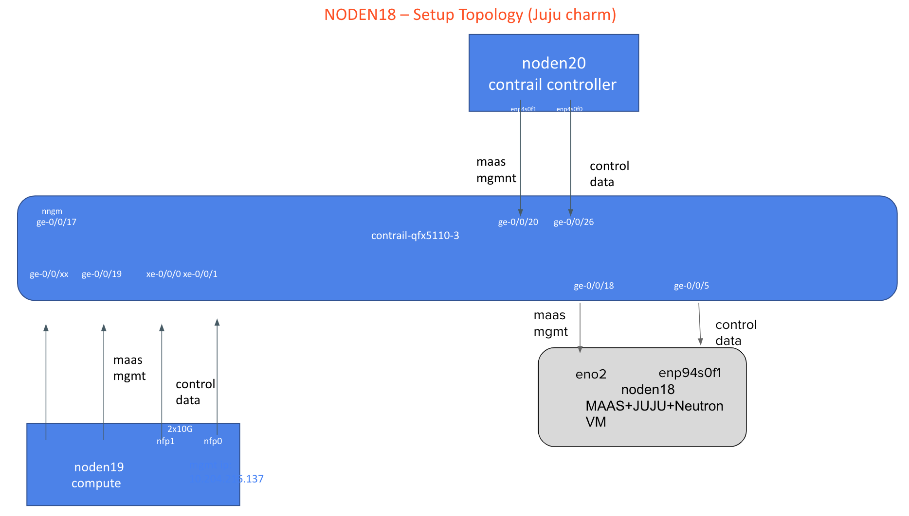

# Juju MAAS deployment

### Topology



* In this example, 3 baremetal machines are used:
  * 1 Orchestrator
  * 1 Controller
  * 1 Compute

### Setup MAAS and Juju

```bash
sudo apt-get install software-properties-common 
sudo add-apt-repository --yes --no-update ppa:maas/2.6 
sudo apt update 
sudo apt install maas -y 
apt install bridge-utils -y 
apt install snapd -y 
snap install juju --classic
# Install juju again if you get hook error
# Close existing terminal and open new terminal if juju is not added in PATH 
dpkg-reconfigure maas-region-controller 
ssh-keygen 
maas createadmin 
maas-region apikey --username=admin > maas.admin.key 
maas login admin http://localhost:5240/MAAS/api/2.0 - < maas.admin.key
```

### Bridge on MAAS node

* Define a bridge on the MAAS node. Add the private management port and bridge configurations. Typical contents of /etc/netplan/*.yaml are shown below; modify this accordingly.

```bash
network:
  version: 2
  renderer: networkd

  ethernets:
    eno1:
      dhcp4: yes
    eno2:
      dhcp4: no
      dhcp6: no
    enp94s0f1:
      dhcp4: no
      dhcp6: no

  bridges:
    br1:
      interfaces: [eno2]
      addresses: [192.168.30.18/24]
      gateway4: 192.168.30.254
      nameservers:
        addresses: [8.8.8.8]
      parameters:
        stp: false
        forward-delay: 0
      dhcp4: no
      dhcp6: no
    br2:
      interfaces: [enp94s0f1]
      addresses: [192.168.40.18/24]
      gateway4: 192.168.40.254
      nameservers:
        addresses: [8.8.8.8]
      parameters:
        stp: false
        forward-delay: 0
      dhcp4: no
      dhcp6: no
```
netplan generate \
netplan apply

### MAAS WebUI

* Upload to the MAAS webUI under the “admin” tab (top right of MAAS webUI) -> ssh keys \
cat ~/.ssh/id_rsa.pub
* The subnet of the bridge created on the MAAS node will reflect in the MAAS webUI under the “subnets” tab. On the newly created subnet of the bridge (192.168.30.0/24); i.e. the management network:
  * Click on “untagged” and enable DHCP (take action drop down)
  * Define an appropriate subnet range
  * Give the subnet a DNS of 8.8.8.8
  * Gateway: 192.168.30.18
* For the 192.168.40.0/24 subnet, give 192.168.40.18 as Gateway

### Virsh configuration

* Add juju and neutron VMs by following the instructions given below
* Libvirt creates a default DHCP enabled network for guests upon installation with you can see by running sudo virsh net-list
```bash
sudo apt install bridge-utils qemu-kvm libvirt-bin
```
* Since we don’t need it, let’s delete it by running:
```bash
sudo virsh net-destroy default  
sudo virsh net-undefine default
```
* Instead, we will be using bridged networking with our existing bridge (br1) created during the previous step, along with the necessary minimal configuration.
* Create a net-default.xml file with the following content:
```bash
<network>  
    <name>default</name>  
    <forward mode="bridge" />  
    <bridge name="br1" />  
</network>
```
* Add it to virsh:
```bash
virsh net-define net-default.xml
virsh net-autostart default  
virsh net-start default
```
* Next, create a storage pool for the VMs. By default, none are defined, so let’s confirm and configure a directory-based pool:
```bash
virsh pool-define-as default dir - - - - "/var/lib/libvirt/images"  
virsh pool-autostart default  
virsh pool-start default
```
* Routing configurations:
  * We will enable NATing and routing on our MAAS pod only, and all the other pods will be using MAAS as a gateway.
  ```bash
  /sbin/iptables -t nat -A POSTROUTING -o eno1 -j MASQUERADE
  /sbin/iptables -A FORWARD -i eno1 -o br1 -m state --state RELATED,ESTABLISHED -j ACCEPT
  /sbin/iptables -A FORWARD -i br1 -o eno1 -j ACCEPT
  sudo sysctl -w net.ipv4.ip_forward=1
  ```
* Pod configuration:
  * For MAAS to query and manage machines as pods, both remotely and the local host, we will be using secure communication for libvirt over SSH.
  ```bash
  sudo mkdir -p ~maas
  sudo chown maas:maas ~maas
  sudo chsh -s /bin/bash maas
  sudo -u maas ssh-keygen
  sudo -u maas -i ssh-copy-id root@192.168.30.18
  sudo -u maas virsh -c qemu+ssh://root@192.168.30.18/system list --all
  ```
* Go back to the MAAS UI to add the local machine as a pod:
  * Select the “Pod” tab, and click “Add Pod” on the top right corner. Provide the requested info: - Name: MAAS Pod - Pod type: Virsh (virtual systems) - Virsh address: qemu+ssh://ubuntu@192.168.30.18/system
* Compose 2 VMs under Pod created in the above step, select default pool and Tag them juju and neutron VM 
* Add machines in MAAS webUI and tag them appropriately
  * While adding give BMC IP and MAC for Power configuration
  * Configure the control data interface(192.168.40.0/24) in controller, compute and neutron to auto-assign or static assign ip

### Bootstrap the JUJU controller

juju add-cloud (name) --local\
Cloud Types \
  *maas \
  manual \
  openstack \
  oracle \
  vsphere \
API endpoint: http://(maas-ip-here):5240/MAAS 

juju add-credential  \
Enter credential name: (name) \
region: default \
aouth: (From ui under maas username) 

juju bootstrap --debug --no-gui --bootstrap-constraints tags=juju mymaas myjujucontroller --bootstrap-series=bionic

If you get instance deployed but not started, try giving timeout \
juju bootstrap --debug --no-gui --bootstrap-constraints tags=juju mymaas myjujucontroller --bootstrap-series=bionic --config bootstrap-timeout=1300

juju deploy (give-bundle.yaml-here)